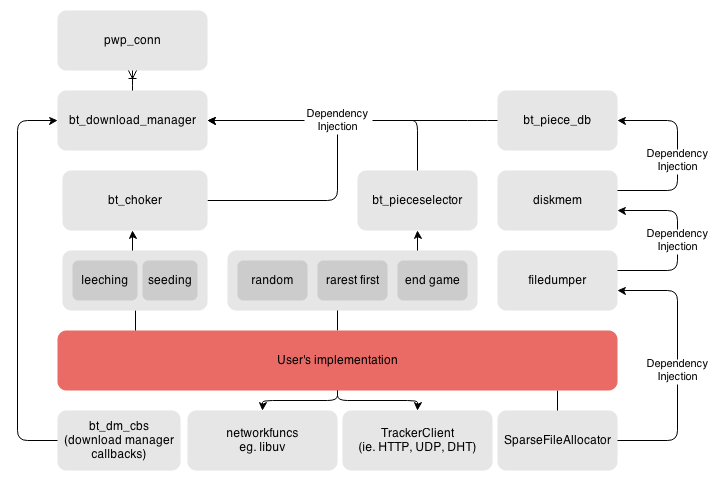

.. image:: https://travis-ci.org/willemt/YABTorrent.png
   :target: https://travis-ci.org/willemt/YABTorrent

What?
-----
Yet another Bittorrent client/library written in C with a BSD license. The client has been intended to be used as a drop-in bittorrent library. The client is in ALPHA and currently has 130+ unit tests covering the code base.

How does it work?
-----------------

YABTorrent is event based.

**Networkfuncs** is a set of networking functions that need to be implemented for the required plumbing. Currently networkworkfuncs_libuv.c is a libuv implementation.

See bt.h for documentation.

Below is a description of the key source files:

- yabtorrent.c: main()
- network_adapter_libuv_v0.10.c: Implementation of network stack
- bt_download_manager.c: Key functions for orchestrating the download
- bt_peer_manager.c: Collection of peers
- bt_piece.c: Manage piece data (ie. write/read and progress)
- bt_piece_db.c: Collection of pieces
- bt_blacklist.c: Block peers from sending invalid pieces
- bt_choker_leecher.c: Choker algorithm for leechers
- bt_choker_seeder.c: Choker algorithm for seeders
- bt_diskcache.c: In-memory file layer that manages a LRU cache over another file layer
- bt_diskmem.c: In-memory file layer (for testing only)
- bt_filedumper.c: File layer that writes/reads to disk
- bt_selector_endgame.c: End game piece selection alogrithm
- bt_selector_random.c: Random piece selection alogrithm
- bt_selector_rarestfirst.c: Rarest first piece selection alogrithm
- bt_selector_sequential.c: Sequential piece selection alogrithm

Example usage
-------------
https://github.com/willemt/dogebox - a Bittorrent Sync clone

Building
--------

$git clone https://github.com/willemt/YABTorrent

$cd YABTorrent

$python waf configure

$python waf build

Usage
-----

$./bt torrentfile.torrent

Why?
----
1. There aren't any bittorrent clients in C that are licensed under non-copyleft licenses
2. There aren't any lightweight bittorrent C libraries that aim to be integrable outside of their intended use case

Help/Todo
---------
If you want to help out with development, please look into the following:

- BEP 5 - DHT Protocol - github.com/willemt/CTrackerClient simply needs to handle the "dht://" schema. github.com/jech/dht can be used to add this functionality.
- BEP 2 - uTorrent transport protocol - you need to create a "networkfuncs_utp.c" source file which implements all the network callbacks. "networkfuncs_utp.c" would simply be a wrapper of github.com/bittorrent/libutp.
- BEP 9 - Extension for Peers to Send Metadata Files
- uTorrent Peer Exchange
